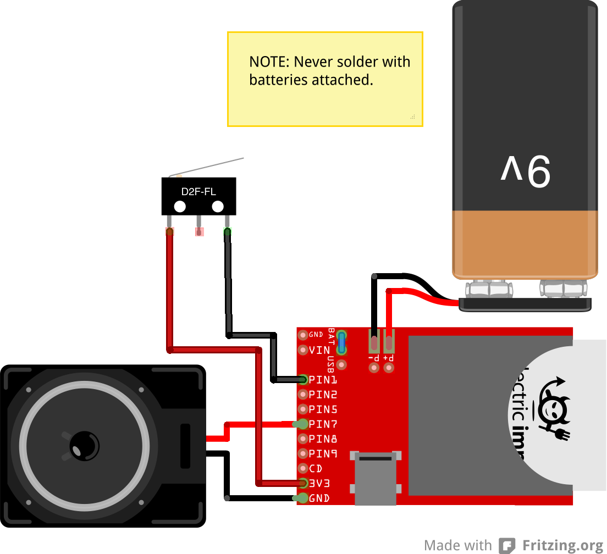

# Secret Lockbox
Create a simple lockbox that will send you alerts when it's opened by unauthorized users! 

# Hardware

## Component List:
For this project you will need the following:

- 1x [Electric Imp](https://www.sparkfun.com/products/11395)
- 1x [April Breakout](https://www.sparkfun.com/products/11400)
- 1x [Micoswitch](https://www.sparkfun.com/products/98)
- 1x [8Ω Speaker](https://www.sparkfun.com/products/10722)
- 1x [9v Battery Clip](https://www.sparkfun.com/products/91)
- 1x [Wooden Project Box](http://www.amazon.com/gp/product/B001767QPS)

## Circuit
You will want to build the following circuit:




# Software
For this project you will need:

- A free [Electric Imp account](https://ide.electricimp.com)
- A free [MailGun account](https://mailgun.com/signup)

This project assumes you have basic familiairity with the Electric Imp platform. If this is your first Electric Imp project, follow the [Quick Start Guide](http://electricimp.com/docs/gettingstarted/quickstartguide/).

## Software Modifications
For this code to run, you will need to make some changes to the agent code. 

Lines 142, 143, and 145 should be changed to include *YOUR* mailgun credentials:

```
local url = "https://api.mailgun.net/v2/sample.mailgun.org/messages";
local fromEmail = "alarm@sample.mailgun.org";

local headers = { "Authorization": "Basic " + http.base64encode("api:API-KEY") };
```

Lines 164 and 167 should be changed to include the password you would like to use, and the email address you would like alerts sent to:

```
// Define your password
const PASSWORD = "yourpassword"

// Define what email to notify
const EMAIL = "you@example.com";
```

# License
Secret-Lockbox is 'licensed' with the [Unlicense]](LICENSE.md)

